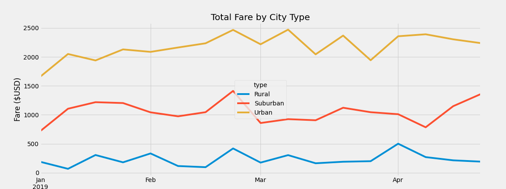
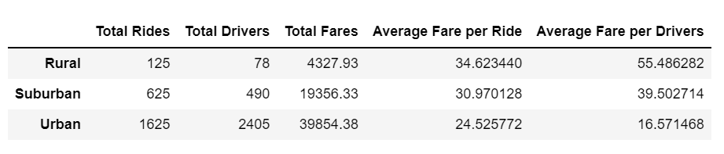

# PyBer_Analysis
OSU Challenge 5 - Python and Matplotlib

Overview of the analysis:

Combine the ride share databases to investigate the differences between 'urban', 'suburban', and 'rural' ride data.

Results: A line graph broken down into three categories: 'urban, 'suburban', and 'rural'.  The results are displayed on a line graph which shows how each sector performed over a four-month period from January through April in 2019.  The data were filtered by total ride fares ($USD) on a weekly basis. 

Summary: 
- The glaring weakness in the dataframe is that there are no data relating to distance of ride - whether one way or round trip.  Obviously trips eminating from a rural or suburban environment into the suburb/city would be longer and more costly for the rider than any rides staying withing the urban environment.  A further dive into the time/distance of each ride might bring light to this analysis.
- Rural drivers are taking (on average) more of the 'ride load' than their suburban or urban counterparts - .624 v. .784 v .675.  This surely accounts for their increased share of the fares: $34.62 versus $30.97 for suburban and $24.53 for urban drivers.  See below:

- The anomaly between difference in ride share for (drivers per ride) and cost should be contributed to price difference in different goegraphic sectors.
- One reccomendation to reduce the cost of rides in the rural areas is to increase the amount of drivers thereby increasing competition.
